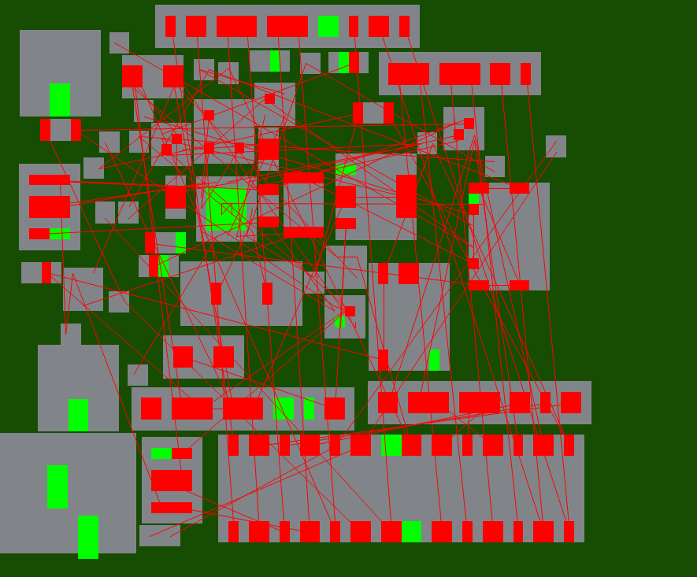

# PCB Climber
This is my attempt to implement the GA described in this [paper](https://asmedigitalcollection.asme.org/electronicpackaging/article-abstract/118/1/11/404553/PCB-Layout-Design-Using-a-Genetic-Algorithm?redirectedFrom=fulltext) using the Rust Programming language 

Note: since it is paywalled, and to make sure I knew what I was doing. I rewrote the key pieces here : [GA_breakdown.pdf](GA_breakdown.pdf)

# Project Structure 
There a 3 files, (maybe should be 4)
- [plcmnt.rs](pcb-layout/src/plcmnt.rs)
- [kicad_parse.rs](pcb-layout/src/kicad_parse.rs)
- [main.rs](pcb-layout/src/main.rs)

Main is our runner, cli, and has the struct and impl for our individual Kicad parse is for parsing kicad_pcb files. Its really ugly right now and kind of buggy I think. plcmnt has our struct representation of a pcb (basically)

I am attempting to keep an engineering notebook in [little-notebook.md](little-notebook.md).

Now that I have plotting working, you can see the progress by looking at test-100x1000.png and [test.md](pcb-layout/test.md)

## Previous Work

https://docs.rs/kicad_parse_gen/latest/kicad_parse_gen/layout/index.html
https://github.com/racklet/kicad-rs/tree/main
https://github.com/The-OpenROAD-Project/SA-PCB
https://dspace.mit.edu/bitstream/handle/1721.1/139247/Crocker-pcrocker-meng-eecs-2021-thesis.pdf?sequence=1&isAllowed=y 

https://ieeexplore.ieee.org/stamp/stamp.jsp?tp=&arnumber=6269973

