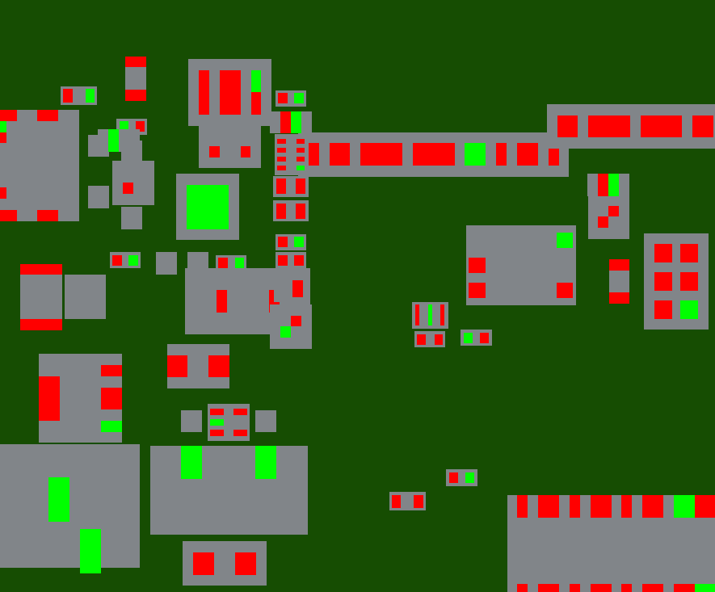
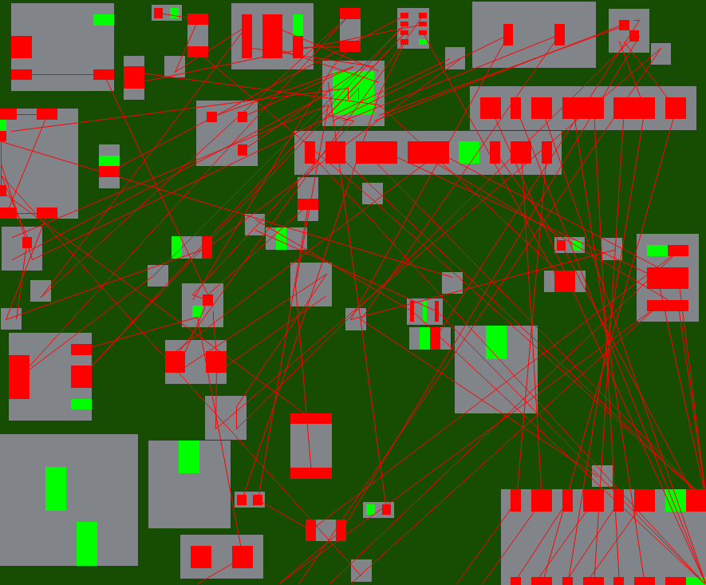

# PCB Climber 
Mackenzie Norman

This started as my attempt to implement the GA described in this [paper](https://asmedigitalcollection.asme.org/electronicpackaging/article-abstract/118/1/11/404553/PCB-Layout-Design-Using-a-Genetic-Algorithm?redirectedFrom=fulltext) using the Rust Programming language 

Note: since it is paywalled, and to make sure I knew what I was doing. I rewrote the key pieces here : [GA_breakdown.pdf](GA_breakdown.pdf)



This project uses a Genetic Algorithim (GA) to generate "good" pcb layouts. It can read in some .kicad_pcb files. It features a CLI using CLAP and is multithreaded using Rayon. It also uses the plotters library to make nice plots of  placements.

The GA optimizes for 3 variables which are summed to calculate the fitness. 
- HPWL: calculated on a per net basis. In the real world, layouts with Via anywhere don't need to worry about routing gnd so I sometimes ignore it.
- placement area: currently this is just the bounding box of all the components, ideally this should be Convex Hull or some other more accurate area calculation
- Overlap: A large penalty is added if components overlap.


# Building 
to build the exe simply run :
```cargo build --release``` 
the .exe will then be in 
`target\release\pcb-layout.exe`

# Usage 
Now either with the path above, or just with `cargo run --release --` you can run the exe and use the cli. 
```
Usage: pcb-layout.exe [OPTIONS]

Options:
  -f, --file <FILE>
          Name of the .kicad_pcb file to use. Use synthetic to use the generated toy case. This probably will error on some boards. The parser was a bit of an afterthought and desperately needs more time [default: "../arduino_kicad/arduino UNO.kicad_pcb"]
  -g, --generations <GENERATIONS>
          Number of generations [default: 1000]
  -p, --population-size <POPULATION_SIZE>
          How many individuals are in our popuation [default: 100]
  -t, --test
          Run the testing function on our file (will override gen/pop)- right now this is the only way to see SA results too
  -s, --selection
          Selection Type (ev or elitist) 
  -a, --animate
          Generate an animation
      --threads <THREADS>
          Number of threads (GA only), this is a bit of misnomer since its really how many groups the populations will be split into and then rayon deals with it [default: 1]
  -h, --help
          Print help
  -V, --version
          Print version
``` 


# Project Structure 

- [plcmnt.rs](pcb-layout/src/plcmnt.rs)
- [ga.rs](pcb-layout/src/ga.rs)
- [sa.rs](pcb-layout/src/sa.rs)
- [kicad_parse.rs](pcb-layout/src/kicad_parse.rs)
- [main.rs](pcb-layout/src/main.rs)

Main is our runner and cli, plus a helper function for generating a dummy placment if you don't have a kicad_pcb 
GA has our various selection operators and has the struct and impl for our individual. 
Kicad parse is for parsing kicad_pcb files. Its really ugly right now and kind of buggy I think. 
plcmnt has our struct representation of a pcb (basically, it really is just boxes and pins)

I attempted to keep an engineering notebook in [little-notebook.md](little-notebook.md).


Now that I have plotting working, you can see the progress by looking at test-100x1000.png and [test.md](pcb-layout/test.md)




# Project Write-up
## How I feel
I think this project exactly met my expectations. I still wish I could've done more. 

The hard part about stuff like this is juggling between learning and results, and I think as usual I prioritized "results" over learning and kind of wish it would've been different. 10 week terms are hard. A good example is parallelism and the rand functions. I never really got any speed ups from running things in parallel either with threads or Rayon. I assume part of this is me using clone to heavily since I did not want to deal with references and part of this is my rand function. (also maybe this isnt a great parallel problem). 

## Wins
- Did implement all my GA functionality
- Implemented an SA too and even started on a PSA. 
- Can parse a pcb (sort of)
- At least added parallel computing (using both rayon and std::threads)


## Not Wins
- Ended up giving up on the discretized version of the code - I might return to this later since I still want to do it. The main reason why this was neccessary is that most pcbs don't use whole numbers and so you'd have to scale things up and round. 
- As mentioned above, parallel did not result in meaningful run time improvement
- Using a lot of clones still. Not too expensive but there certainly can be some improvements.
- It seems like I broke it in one of the newer versions. It still runs but we get some overlaps which ideally would be filtered out
- Ran out of time to do any serious testing

## Continuations
I do plan on keeping up with this project, if nothing else to improve my rust skills. This is what I hope to change/add (in no particular order)
- finish PSA , I really think this is the best hill climber ND approach to this problem.
- Try a more 'annealing' based approach to SA. i.e instead of using purely random movement, weighting our movement and swap ops so that when temperature decreases - odds of big movements/ swaps decrease. 
- Try to get a more accurate wirelength calc - this might be something that parallel can help with.  
- Maybe try a marco or some sort of expression parser for dealing with kicad files. (I really wish the kicad parse crate had worked. )
- output back to the kicad_file


## Previous Work

https://docs.rs/kicad_parse_gen/latest/kicad_parse_gen/layout/index.html
https://github.com/racklet/kicad-rs/tree/main
https://github.com/The-OpenROAD-Project/SA-PCB
https://dspace.mit.edu/bitstream/handle/1721.1/139247/Crocker-pcrocker-meng-eecs-2021-thesis.pdf?sequence=1&isAllowed=y 


https://ieeexplore.ieee.org/stamp/stamp.jsp?tp=&arnumber=6269973